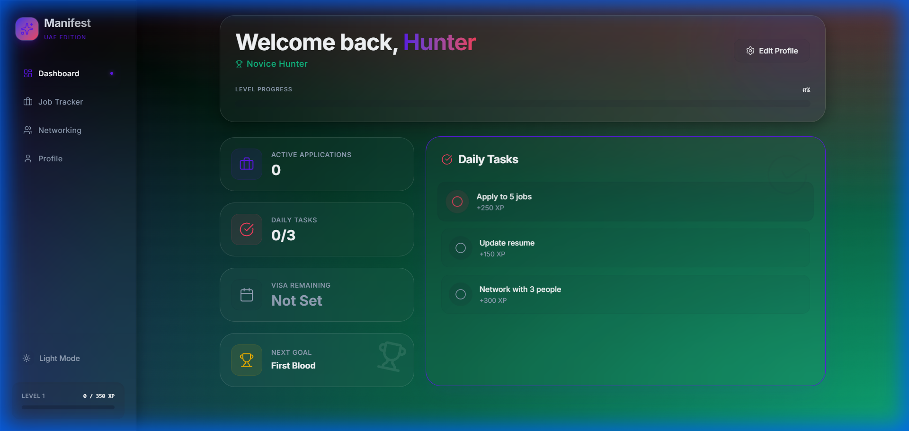
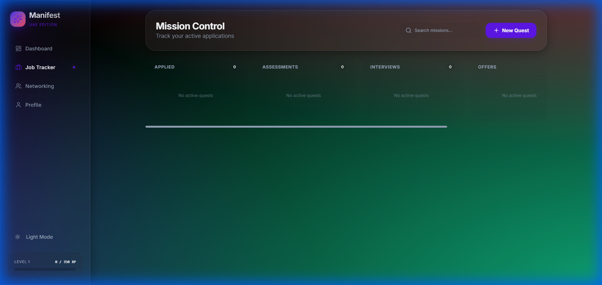
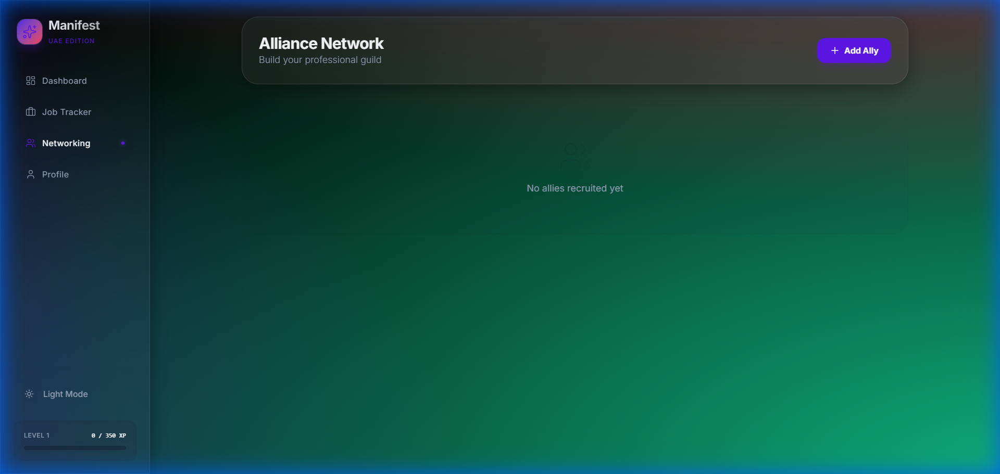

# Manifest - Gamified Job Hunting Helper



> A gamified job application tracker and networking CRM designed to make the job hunt in the UAE engaging and organized.


## 🚀 Features

### 📊 Dashboard & Gamification
Stay motivated with a gamified progression system.
- **XP System**: Earn XP for every job application, networking message, and daily task.
- **Levels & Titles**: Level up from "Novice Hunter" to "Dubai Tycoon".
- **Streaks**: Maintain your daily streak (weekends are safe!) to earn massive bonuses.
- **Visa Tracker**: Keep an eye on your visit visa expiry date.

### 📋 Job Tracker
A Kanban-style board to manage your applications.
- **Drag & Drop**: Move jobs from 'Applied' to 'Interview' and 'Offer'.
- **Details**: Add notes, links, and salary info.



### 🤝 Networking CRM
Manage your professional connections.
- **Status Tracking**: Track who you've contacted, who replied, and who you're meeting.
- **Reminders**: Set follow-up dates to never drop the ball.



## 🛠️ Tech Stack

- **Frontend**: React, TypeScript, Vite
- **Styling**: Tailwind CSS, Framer Motion (for animations)
- **State Management**: Zustand
- **Icons**: Lucide React

## 🎮 Gamification Guide

| Action | XP Reward | Notes |
| :--- | :--- | :--- |
| **Add Job** | `150 XP` | Log every application! |
| **Interview** | `300 XP` | Moving a job to 'Interview' column. |
| **Offer** | `1000 XP` | The ultimate goal! |
| **Daily Tasks** | `150-300 XP` | Complete 3 random tasks daily. |
| **Streak Bonus** | `25% of Level` | Complete all daily tasks to get a huge bonus. |

## 📦 Getting Started

1.  **Install dependencies**:
    ```bash
    npm install
    ```

2.  **Start the development server**:
    ```bash
    npm run dev
    ```

3.  **Build for production**:
    ```bash
    npm run build
    ```
